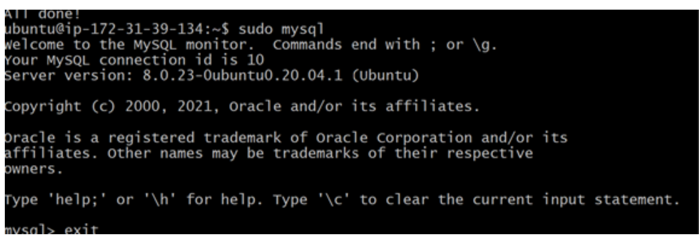
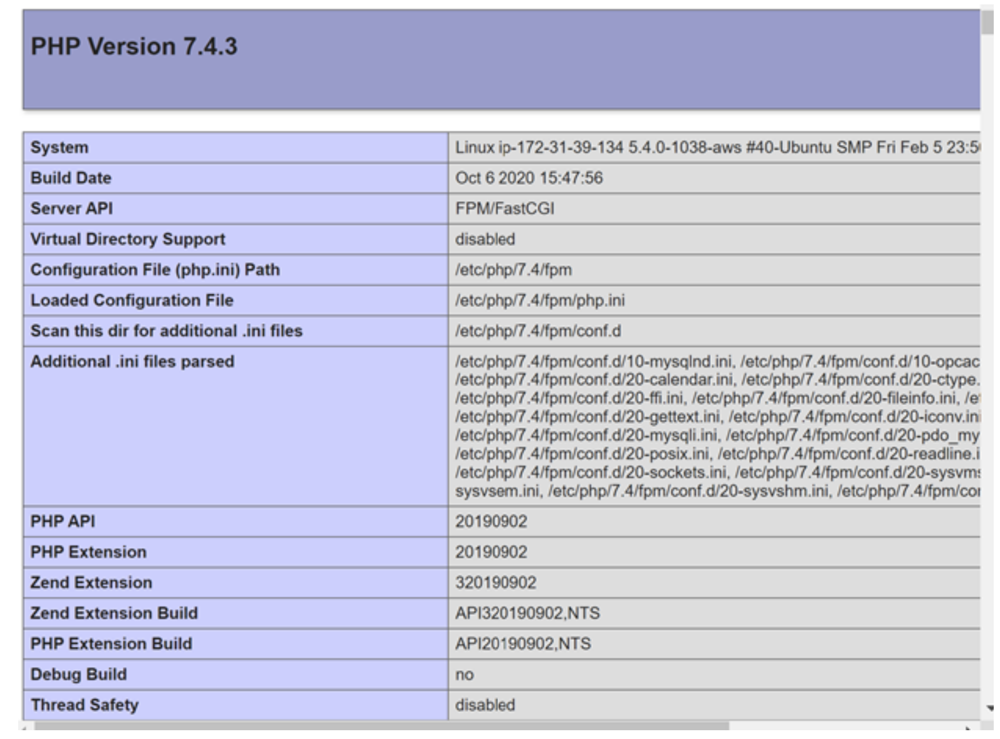

## WEB STACK IMPLEMENTATION (LEMP STACK)

* Update packages
```
sudo apt update
```
* Install NGINXWEB
```
sudo apt install nginx
```
```
sudo systemctl status nginx
```


* Security group edit
  HTTP/ TCP port 80
* I test nginx server to know if its responding to internet with IP address on  url


* install Mysql
```
sudo apt install mysql-server
```
```
sudo mysql_secure_installation
```
```
sudo mysql
```


* Installing PHP,configuring Nginxto use PHP Processor and Testing PHP with Nginx

```
sudo apt install php -fpm php-mysql
```
* Create web for Directory
```
sudo mkdir /var/www/projectLEMP
```
* Change ownership
```
sudo chown -R $USER:$USER /var/www/projectLEMP
```
* Opened a new configuration file in nginx with
```
sudo nano /etc/nginx/sites-available/projectLEMP
```
```
#/etc/nginx/sites-available/projectLEMP

server {
    listen 80;
    server_name projectLEMP www.projectLEMP;
    root /var/www/projectLEMP;

    index index.html index.htm index.php;

    location / {
        try_files $uri $uri/ =404;
    }

    location ~ \.php$ {
        include snippets/fastcgi-php.conf;
        fastcgi_pass unix:/var/run/php/php7.4-fpm.sock;
     }

    location ~ /\.ht {
        deny all;
    }

}
```
* Activated configuration by linking to configuration file from nginx
```
sudo in -s /etc/nginx/sites-available/projectLEMP/etc/nginx/sites-enabled/
```
* Test configuration for syntax error
```
sudo nginx -t
```
* To disable the default nginx host
```
sudo unlink/etc/nginx/sites-enabled/default
```
* Reload nginx to apply the changes
```
sudo systemctl reload nginx
```
* Create an index html file
```
sudo echo ‘Hello LEMP from hostname’ $ (curl -s http://169.254.169.254/ latest/meta-data/public-hostname) ‘with public IP’ $(curl -s http:// 169.254.169.254/latestmeta-data/public-ipv4) > /var/www/projectLEMP/index.html
```
*  From my url  “echo”

Testing PHP with Nginx
```
nano/var/www/project.LEMP/info.php
```
```
<?php
phpinfo();
```

* add "/info.php to the ip addr on url"



* Retrieving data from MySQL Database with PHP
```
sudo mysql
```

* Test if new user has permission to login to mysql console

```
mysql -u example_user -p
```
```
SHOW DATABASES;
```


```
CREATE TABLE example_database.todo_list ( item_id INT AUTO_INCREMENT, content VARCHAR(255),
PRIMARY KEY(item_id) );
```
INSERT INTO example_database.todo_list (content) VALUES ("My first important item");
```
SELECT * FROM example_database.todo_list;
```


```
Nano /var/www/projectLEMP/todo_list.php
```
```
<?php
$user = "example_user";
$password = "password";
$database = "example_database";
$table = "todo_list";

try {
  $db = new PDO("mysql:host=localhost;dbname=$database", $user, $password);
  echo "<h2>TODO</h2><ol>";
  foreach($db->query("SELECT content FROM $table") as $row) {
    echo "<li>" . $row['content'] . "</li>";
  }
  echo "</ol>";
} catch (PDOException $e) {
    print "Error!: " . $e->getMessage() . "<br/>";
    die();
}
```
* add “todo_list.php” to theaddress on url


