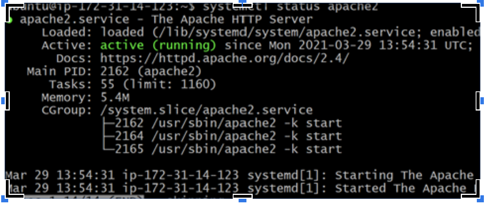

## Installing Apache and Updating the Firewall
* updating the package

```
sudo apt update
```
* install apache2
```
sudo apt install apache2
```
* check apache status
```
sudo systemctl status apache2
```

*Enable firewall
```
sudo ufw enable
```
* http://3.15.223.31:80


* Installation of mysql
```
sudo apt install mysql-server
```
```
sudo mysql_secure_installation
```
```
sudo mysql
```


 INSTALLATION OF PHP, CREATING VIRTUAL HOSTFOR THE WEBSITE USING APACHE AND ENABLINING PHP ON THE WEBSITE

```
sudo apt install php libapache2-mod-php php-mysql
```
```
php -v
```
* INSTALLATION OF PHP, CREATING VIRTUAL HOSTFOR THE WEBSITE USING APACHE AND ENABLINING PHP ON THE WEBSITE

* Create directory
```
sudo mkdir /var/www/projectlamp
```
* change ownership
```
sudo chown -R $USER:$USER /var/www/projectlamp
```
* Createconfiguration file  in Apache site available using vi
```
sudo vi /etc/apache2/sites-available/projectlamp.conf
```
``` 
sudo a2nsite projectlamp
```
* Reload apache2 for the change to take effect
```
sudo systemctl reload apache2
```
* Create an index html
```
sudo echo 'Hello LAMP from hostname' $(curl -s http://169.254.169.254/latest/meta-data/public-hostname) 'with public IP' $(curl -s http://169.254.169.254/latest/meta-data/public-ipv4) > /var/www/projectlamp/index.html
```
##Enable PHP on the website
```
sudo vim /etc/apache2/mods-enabled/dir.conf
```
* Reload apache2 for the change to take effect
```
sudo systemctl reload apache2
```
* Create a new file named index.php inside custom web root folder
```
vim /var/www/projectlamp/index.php
```
* page refresh
