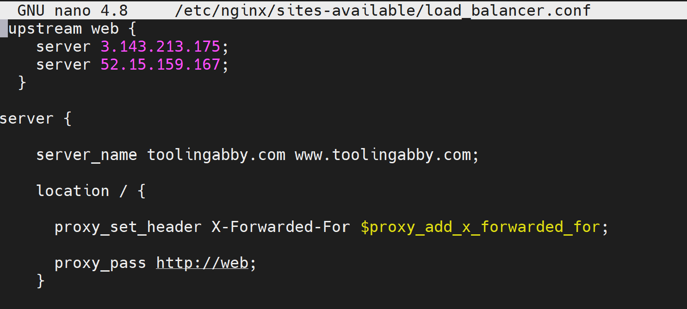
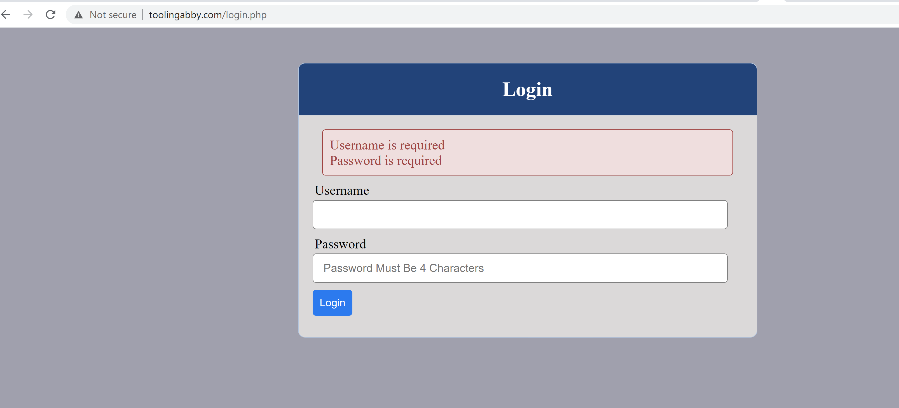
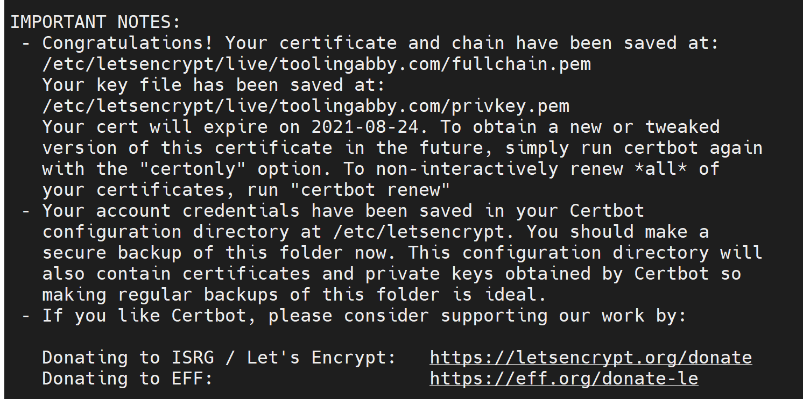
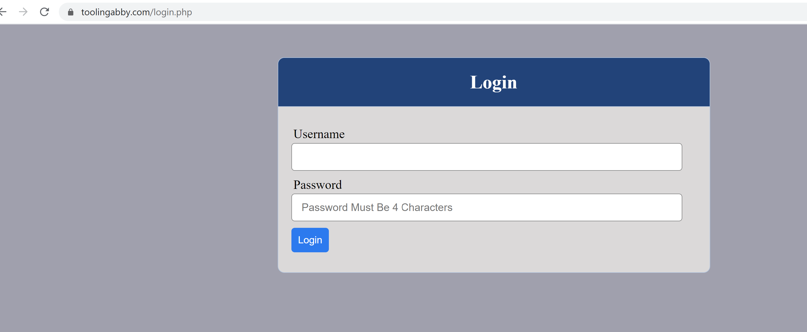

# Load Balancer Solution With Nginx and SSL/TLS

* Part 1 - Configure Nginx As A Load Balancer

* Create EC2 VM based on Ubuntu

Install Nginx

```
sudo apt update
sudo apt install nginx
```

```
sudo systemctl enable nginx

sudo systemctl start nginx

sudo systemctl
status nginx
```

* Configure Nginx LB using Web Servers

```
sudo nano /etc/nginx/sites-available/load_balancer.conf
```


* Remove default site for our reverse proxy to redirect to newly configuration file

```
sudo rm -f /etc/nginx/sites-enabled/default
``` 
* Check nginx

```
sudo nginx -t
```

```
cd
```
* Link LB configuration file in site available to site enable for nginx to access configuration

```
sudo ln -s ../sites-available/load_balancer.conf .
```

* Part 2 - Register a new domain name and configure secured connection using SSL/TLS certificates

* Domain name 'toolingabby.com'


* Do all the management by linking domain created 'toolingabby.com ' with AWS ROUTE 53



* Secure the  domain

* Install certbot and request for an SSL/TLS certificate

```
sudo apt install certbot
```

* Install module for certbot usage

```
sudo apt install python3-certbot-nginx -y
```
```
sudo nginx -t
```

```
sudo nginx -s reload
```

* Create certificate for the domain to make it secure

```
sudo certbot --nginx -d toolingabby.com -d www.toolingabby.com
```







