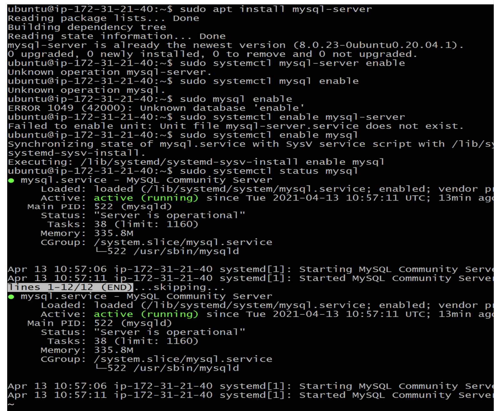

## Client-Server Architecture with MySQL

* Create and configure two Linux-based virtual servers (EC2 instances in AWS)

```
server A mysql server
server B mysql client
```
* install mysql server
```
sudo apt update
```
```
sudo apt install mysql-server
```
```
sudo systemctl enable mysql
```
```
sudo systemctl status mysql
```


* install mysql client

```
sudo apt update
```
```
sudo apt install mysql-client
```
* updating security group of mysql server
* TCP port 3306/custom mysql client ip addr

* Get ip addr on mysql client
```
ip addr show
```
* configuration of mysql server to allow connections from remote host
```
sudo mysql_secure_installation
```
```
sudo mysql
```
```
CREATE USER ‘remote_user’@’&’ IDENTIFIED WITH mysql_native_password BY ‘password’;
```
```
CREATE USER ‘remote_user’@’&’ IDENTIFIED WITH mysql_native_password BY ‘password’;
```
```
CREATE DATABSE test_db;
```
```
GRANT ALL ON test_db.* TO ‘remote_user’@’&’ WITH GrANT OPTION;
```
```
FLUSH PRIVILEGES;

```
```
exit
```
```
Sudo vi /etc/mysql/mysql.conf.d/mysqld.cnf
```


```
sudo systemctl restart mysql
```
* Remote connection with database engine using mysql utility
* Get private ip addr of mysql-server from EC2 instance
```
sudo mysql -u remote_user -h ip addr -p
```
```
show databases;
```


