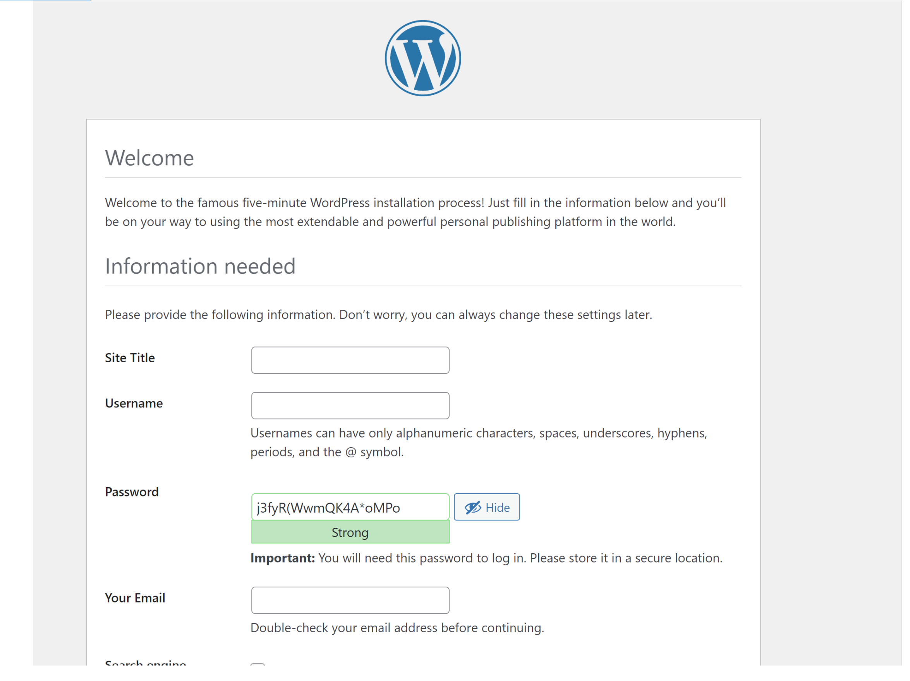

# Web Solution With WordPress

**Step 1 — Prepare a Web Server**

* Launch an EC2 instances that will serve as WEB SERVER

* Create and attach 3 volumes to the WEB SERVER EC2 each of 10GB

* open terminal

```
lsblk
```
```
ls /dev/
```


```
df -h
```
* Create single partition on each of the 3 disks

```
sudo gdisk /dev/xvdf
```
```
sudo gdisk /dev/xvdg
```
```
sudo gdisk /dev/xvdh
```

* View newly configured partition on each of the 3 disks

```
lsblk
```


* install  lvm2
```
sudo yum install lvm2
```
```
sudo lvmdiskscan
```
* pvcreate to mark each of 3 disks as physical volume (PVs) to be used as LVM

``` 
sudo pvcreate /dev/xvdf1
```
```
sudo pvcreate /dev/xvdg1
```
```
sudo pvcreate /dev/xvdh1
```
* verify physical volume has been created successfully
```
sudo pvs
```


* vgcreate to add all 3 PVs to a volume group (VG) with name webdata-vg

```
sudo vgcreate webdata-vg /dev/xvdf1 /dev/xvdg1 /dev/xdvh1

```
```
sudo vgs
```


* Create 2 logical volumes.apps-lv and logs-lv of equal sizes

```
sudo lvcreate -n apps-lv -L 14G webdata-vg
```
```
sudo lvcreate -n logs-lv -L 14G webdata-vg
```
* Verify successful creation of LV
```
sudo lvs
```


* Verify the entire setup

```
sudo vgdisplay -v
```
```
sudo lsblk
```


* Format the logical volumes with ext4 filesystem

```
sudo mkfs -t ext4 /dev/webdata-vg/apps-lv
```
```
sudo mkfs -t ext4 /dev/webdata-vg/log-lv
```

* Create /var/www/html directory to store website files
```
sudo mkdir -p /var/www/html
```
* Create /home/recovery/logs to store backup of log data
```
sudo mkdir -p /home/recovery/logs
```
* Mount /var/www/html on apps-lv logical volume
```
sudo mount /dev/webdata-vg/apps-lv /var/www/html/
```

* Backup all the files in the log directory /var/log into /home/recovery/logs

```
sudo rsync -av /var/log/. /home/recovery/logs/
```
* mount /var/log on logs-lv
```
sudo mount /dev/webdata-vg/logs-lv /var/log
```
* Restore log files back into /var/log directory
```
sudo rsync -av /home/recovery/logs/. /var/log
```
* Update /etc/fstab file for persistence of mount configuration after restarting server.
* The UUID of the device will be used to update /etc/fstab file
```
sudo blkid
```
```
sudo vi /etc/fstab
```

* Test configuration
```
sudo mount -a
sudo systemctl daemon-reload
```
```
df -h
```

* Step 2 — Prepare the Database Server

* Prepare a database Server

Launch an EC2 instances that will serve as DB SERVER

* Create and attach 3 volumes to the DB SERVER EC2 each of 10GB

* Open terminal

```
lsblk
```

```
ls /dev/
```
```
sudo gdisk /dev/xvdf
```
```
sudo gdisk /dev/xvdg
```
```
sudo gdisk /dev/xvdh
```
* View the newly configured partition on eachof the 3 disks


* Install lvm2
```
sudo yum install lvm2
```
```
sudo lvmdiskscan
```
* Mark each of the 3 disks as physical volume

```
sudo pvcreate /dev/xvdf1 /dev/xvdg1 /dev/xvdh1
```
* Verify physical volume
```
sudo pvs
```
* Add all 3 PVs to a volume group VG. NAME the VG database-vg

```
sudo vgcreate database-vg /dev/xvdf1 /dev/xvdg1 /dev/xvdh1
```
* Verify VG
```
sudo vgs
```


* Create logical volume db-lv
```
sudo lvcreate -n db-lv -L 20G database-vg
```
* verify Logical Volume

```
sudo lvs
```


* Verify the entire setup

```
sudo vgdisplay -v
sudo lsblk
```


* Format LV with ext4 filesystem

```
sudo mkfs -t ext4 /dev/database-vg/db-lv
```

* Create /var/www/html directory to store wesite file
```
sudo mkdir /db
```
* Mount /db on db-lv logical volume

```
sudo mount /dev/database-vg/db-lv /db
```
* Update /etc/fstab file 
* The UUID of the device will be used to update the /etc/fstab file

``` 
sudo blkid
```

``` 
sudo vi /etc/fstab
```


```
sudo mount -a
```
```
sudo systemctl daemon-reload
```
```
df -h
```

* Step 3 — Install Wordpress on your Web Server EC2

* update repository

```
sudo yum update -y
```

* install wget, Apache and it's dependencies

```
sudo yum -y install wget httpd php php-mysqlnd php-fpm php-json
```

* Start Apache

```
sudo systemctl enable httpd
sudo systemctl start httpd
```

* To install PHP and it’s depemdencies

```
sudo yum install https://dl.fedoraproject.org/pub/epel/epel-release-latest-8.noarch.rpm
sudo yum install yum-utils http://rpms.remirepo.net/enterprise/remi-release-8.rpm
sudo yum module list php
sudo yum module reset php
sudo yum module enable php:remi-7.4
sudo yum install php php-opcache php-gd php-curl php-mysqlnd
sudo systemctl start php-fpm
sudo systemctl enable php-fpm
setsebool -P httpd_execmem 1
```
* Restart Apache

```

sudo systemctl restart httpd
```
* Download wordpress and copy wordpress to var/www/html

```
mkdir wordpress
```
```
cd wordpress
```
```
sudo wget http://wordpress.org/latest.tar.gz
```
```
sudo tar xzvf latest.tar.gz
```
```
sudo rm -rf latest.tar.gz
```
```
cd wordpress
```
```
ls -l wordpress
```
```
sudo cp -R wordpress/. /var/www/html
```
```
sudo ls -l /var/www/http
```
```
cd /var/www/html
```
* Configure SELinux Policies

```
sudo chown -R apache:apache /var/www/html/wordpress
 sudo chcon -t httpd_sys_rw_content_t /var/www/html/wordpress -R
 sudo setsebool -P httpd_can_network_connect=1
 ```

 * Step 4 — Install MySQL on your DB Server EC2

 ```
sudo yum update
sudo yum install mysql-server
```
* check status

```
sudo systemctl status mysqld
```
```
sudo systemctl restart mysqld
sudo systemctl enable mysqld
```

* Step 5 — Configure DB to work with WordPress

```
sudo mysql
CREATE DATABASE wordpress;
CREATE USER `wordpress`@`%’ IDENTIFIED BY 'password';
GRANT ALL ON wordpress.* TO 'wordpress'@'%’ WITH GRANT OPTION;
FLUSH PRIVILEGES;
SHOW DATABASES;
exit

```
* Edit bind address to 0.0.0.0
```
sudo vi /etc/my.cnf
```

* Step 6 — Configure WordPress to connect to remote database

* Set MySQL port on DB Server EC2 TO All traffic

* Install MySQL client and test that you can connect from your Web Server to your DB server by using


* Change permissions and configuration so Apache could use WordPress

```

sudo yum install mysql
```
```
sudo vi wp-config.php
```

```

sudo mysql -u wordpress -p -h 3.142.91.76
```




