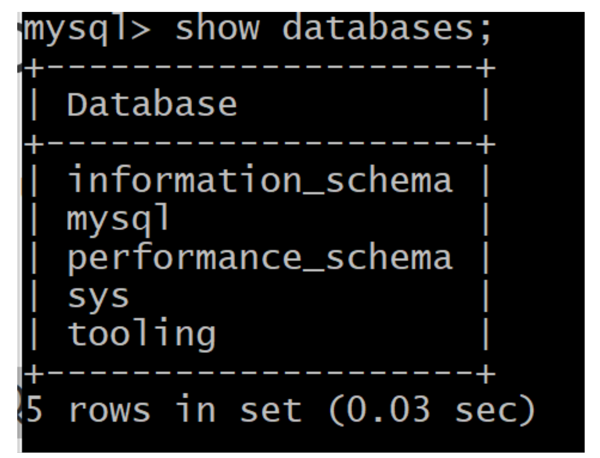
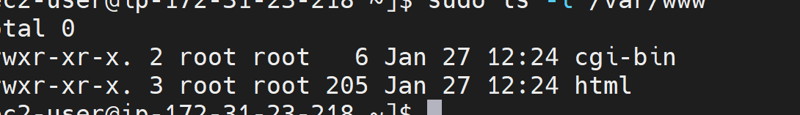
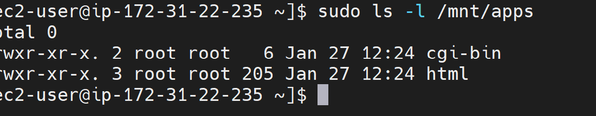
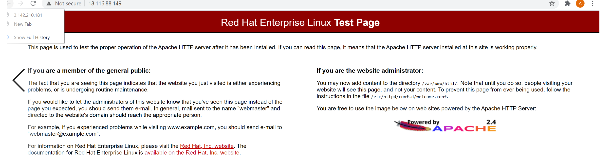
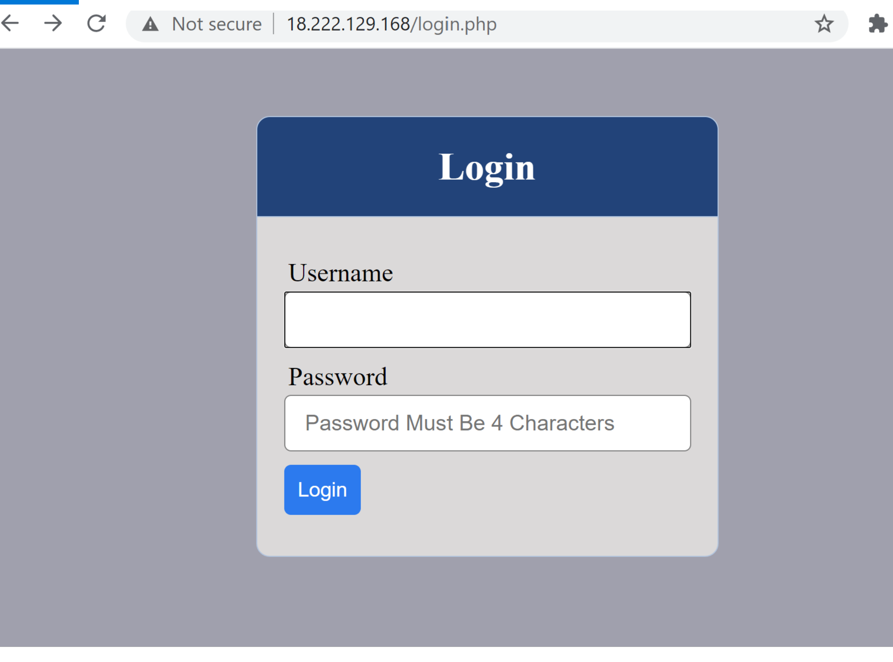
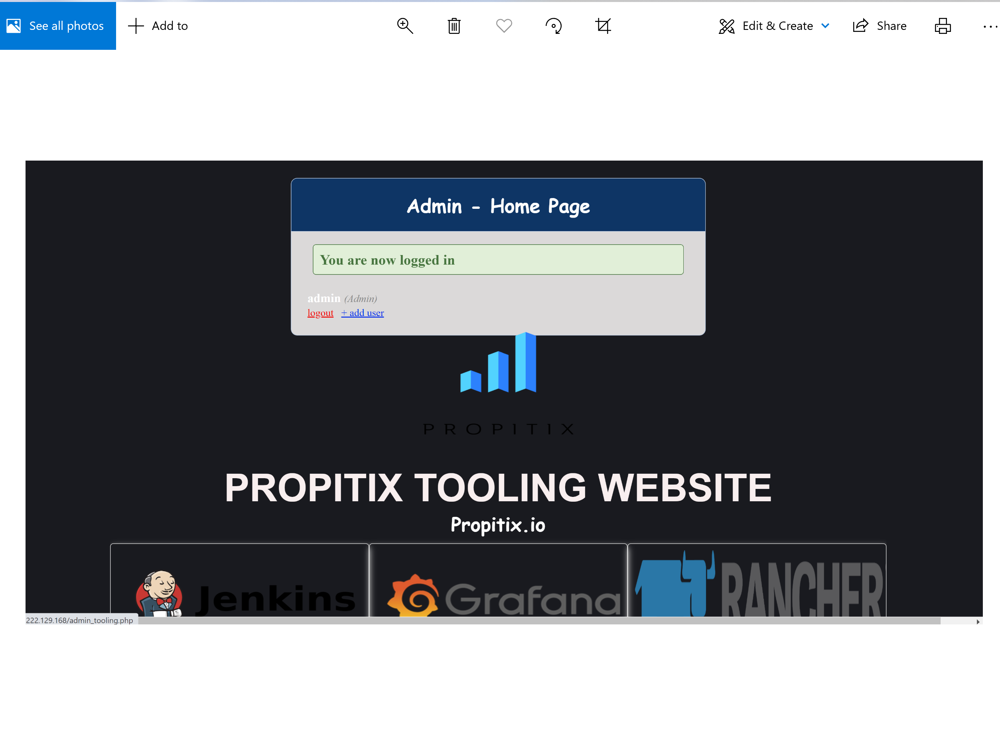

Devops Tooling Website Solution

* ## Step 1 - Prepare NFS Server

* Spin up EC2 instance with RHEL Linux 8

* Add and attache volumes to the instance

* Check for space
```
lsblk
```
* Create partitions

```
sudo gdisk
```
```
lsblk
```
* Craete physical volume

```
sudo pvcreate /dev/xvdf1
```
```
sudo pvs
```
* Create volume group

```
sudo vgcreate webdata-vg /dev/xvdf1
```
```
sudo vgs
```
* Create Logical volume

```
sudo lvcreate -n  lv-apps -L 5G webdata-vg
```
```
sudo lvcreate -n lv-logs -L 5G webdata-vg
```
```
sudo lvcreate -n lv-opt -l 100%free webdata-vg
```

* Make file system
```
mkfs.xfs /dev/webdata-vg/lv-app
```
```
mkfs.xfs /dev/webdata-vg/lv-logs
```
```
mkfs.xfs /dev/webdata-vg/lv-opt
```
```
mkdir mnt/apps
```
```
mkdir mnt/logs
```
```
mkdir mnt/opt
```

```
sudo mount /dev/webdata-vg
/mnt/apps
```
```
sudo mount/dev/webdata-vg /mnt/logs
```
```
sudo mount /dev/webdata-vg /mnt/opt
```
```
df -h
```
```
sudo blkid
```
```
sudo vi /etc/fstab
```
```
sudo mount -a
```
```
sudo systemctl daemon-reload
```
```
df -h
```
```
* Install NFS

sudo yum -y update
sudo yum install nfs-utils -y
sudo systemctl start nfs-server.service
sudo systemctl enable nfs-server.service
sudo systemctl status nfs-server.service
```

* Set permission that allow web server to read, write and execute file on NFS

```
sudo chown -R nobody: /mnt/apps
sudo chown -R nobody: /mnt/logs
sudo chown -R nobody: /mnt/opt

sudo chmod -R 777 /mnt/apps
sudo chmod -R 777 /mnt/logs
sudo chmod -R 777 /mnt/opt

sudo systemctl restart nfs-server.service
```

* Export the mount for webserver

```
sudo vi /etc/exports
```
```

/mnt/apps 172.31.16.0/20(rw,sync,no_all_squash,no_root_squash)
/mnt/logs 172.31.16.0/20(rw,sync,no_all_squash,no_root_squash)
/mnt/opt 172.31.16.0/20(rw,sync,no_all_squash,no_root_squash)

Esc + :wq!

sudo exportfs -arv
```
* set security group to ALL TRAFFIC


* ## Step 2 — Configure the database server

* Install MySQL server
```
sudo apt install mysql-server -y
```
```
sudo systemctl start mysql-server
```
```
sudo systemctl enable mysql-server
```
```
sudo systemctl status mysql-server
```
```
sudo mysql_secure_installation
```
* Install MySQL server
Create a database and name it tooling
Create a database user and name it webaccess
Grant permission to webaccess user on tooling database to do anything only from the webservers subnet cidr

```
mysql> show databases;
```



* Step 3 — Prepare the Web Servers

```
sudo yum install nfs-utils nfs4-acl-tools -y
```
* Mont on /var/www/

```
sudo mkdir 
/var/www
```
```
sudo mount -t nfs -o rw,nosuid 172.31.22.235:/mnt/apps /var/www
```
```
df -h
```
```
sudo vi /etc/fstab
```
```
172.31.22.235:/mnt/apps /var/www nfs defaults 0 0
```
* Install Apache 
```
sudo yum install httpd -y
```
* Verify that Apache files and directories are available on the Web Server in /var/www and also on the NFS server in /mnt/apps. If you see the same files - it means NFS is mounted correctly.

```
sudo ls -l
/var/www
```




 * Locate the log folder for Apache on the Web Server and mount it to NFS server’s export for logs. Repeat step №4 to make sure the mount point will persist after reboot.

* Check for the content in /var/log/httpd and backup before mounting to avoid loss of files
 ```
 sudo ls -l /var/log/httpd
 ```
```
sudo mkdir /home/backup
```

```
sudo cp -R /var/log/httpd /home/backup
```
```
sudo mount -t nfs -o rw,nosuid 172.31.22.235:/mnt/logs /var/log/httpd
```
```
df -h
```


```
sudo cp -R /home/backup/httpd/. /var/log/httpd/
```

* check httpd page



* Fork the tooling source code from Darey.io Github Account to your Github account. (Learn how to fork a repo here)

```
sudo yum install git
```
```
git clone https://github.com/aawodele/tooling.git
```
```
cd tooling
```
```
sudo cp -R html/. /var/www/html/
```

* Install php

* Disable SELinux

* Install mysql-server on the webserver

```
sudo yum install mysql-server
```
```
sudo systemctl start mysql-server
```
```
sudo systemctl enable mysql-server
```
```
sudo mysql -h 172.31.32.212 -u webaccess -p tooling < tooling-db.sql
```


* Update the website’s configuration to connect to the database (in functions.php file). Apply tooling-db.sql script.

```
sudo vi functions.php
```
* Open the website in your browser

```
http://18.222.129.168./login.php
```







* repeat same process of webserver on the remaining 2 servers


 

