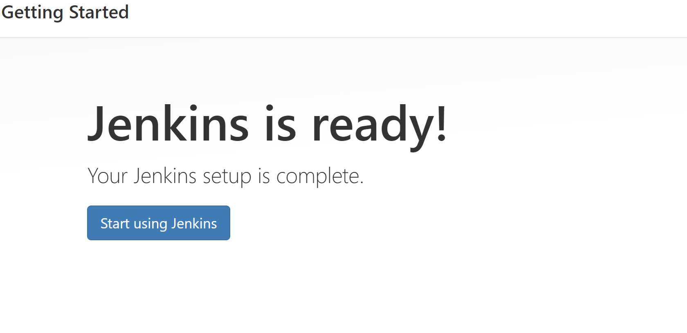
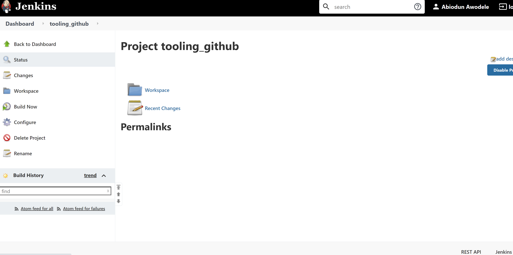
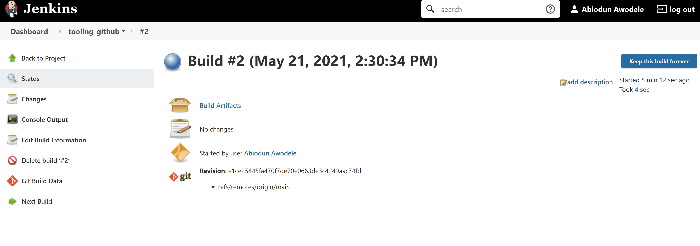
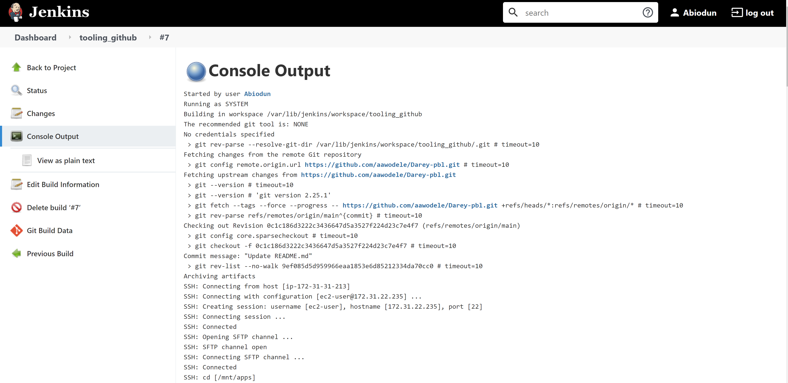
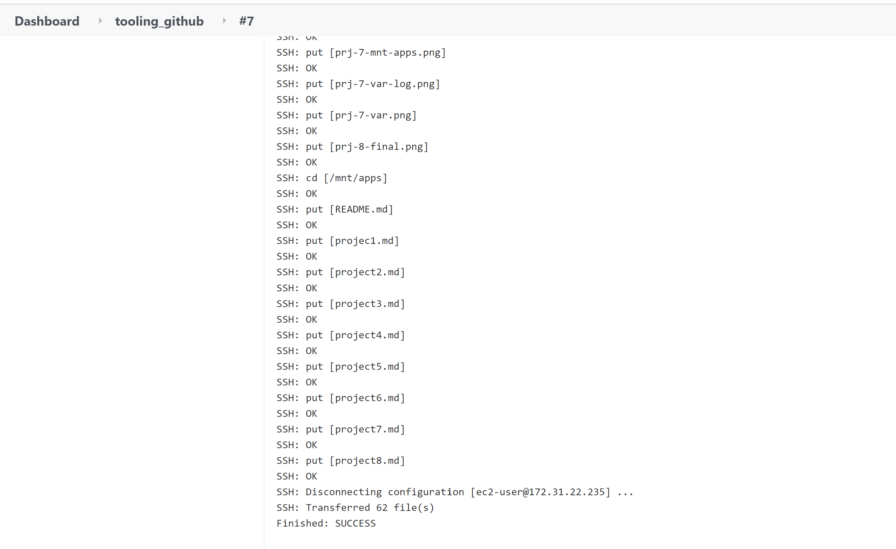
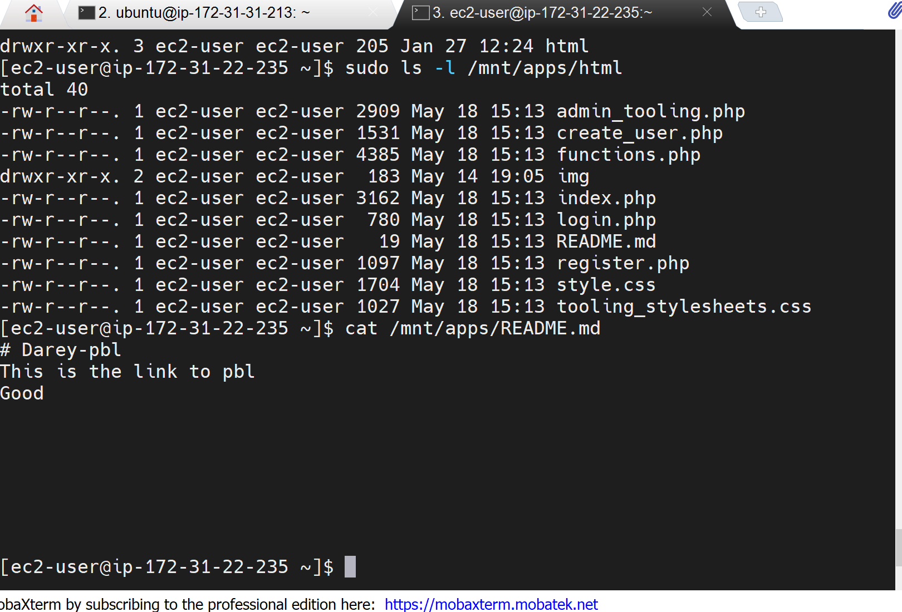

# Tooling Website deployment automation with Continuous Integration. Introduction to Jenkins 

* Step 1 - Install Jenkins server

```
sudo apt update
sudo apt install default-jdk-headless
```


* Install Jenkins

```
wget -q -O - https://pkg.jenkins.io/debian-stable/jenkins.io.key | sudo apt-key add -
sudo sh -c 'echo deb https://pkg.jenkins.io/debian-stable binary/ > \
    /etc/apt/sources.list.d/jenkins.list'
sudo apt update
sudo apt-get install jenkins
```

```
sudo systemctl status jenkins
```
* Security group set to  "all traffic"


* Perform initial Jenkins setup

http://3.133.98.232:8080/:8080





Step 2 - Configure Jenkins to retrieve source codes from GitHub using Webhooks


* First build




* Configure triggering the job from GitHub webhook

* Configure “Post-build Actions” to archive all the files - files resulted from a build are called “artifacts





* Step 3 - Configure Jenkins to copy files to NFS server via SSH

* Install “Publish Over SSH” plugin

* Configure the job/project to copy artifacts over to NFS server.


Provide a private key (content of .pem file that you use to connect to NFS server via SSH/Putty)
Arbitrary name
Hostname - 172.31.22.235
Username - ec2-user 
Remote directory - /mnt/apps 

* 






